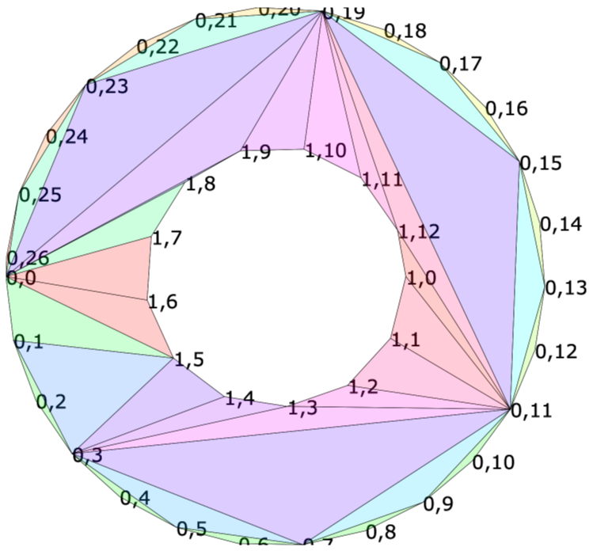

## Earcutr

This is a single-threaded Polygon triangulation library, translated into 
the Rust computer language from the original javascript code of MapBox's 
Earcut. Please see https://github.com/mapbox/earcut for more information 
about the original javascript code.



#### Usage

```rust
extern crate earcutr;
var triangles = earcutr::earcut(&vec![10,0, 0,50, 60,60, 70,10],&vec![],2);
println!("{:?}",triangles);  // [1, 0, 3, 3, 2, 1]
```

Signature: 

`earcut(vertices:&vec<f64>, hole_indices:&vec<usize>, dimensions:usize)`.

* `vertices` is a flat array of vertex coordinates like `[x0,y0, x1,y1, x2,y2, ...]`.
* `holes` is an array of hole _indices_ if any
  (e.g. `[5, 8]` for a 12-vertex input would mean one hole with vertices 5&ndash;7 and another with 8&ndash;11).
* `dimensions` is the number of coordinates per vertex in the input array (`2` by default).

Each group of three vertex indices in the resulting array forms a triangle.

```rust
// triangulating a polygon with a hole
earcutr::earcut(&vec![0.,0., 100.,0., 100.,100., 0.,100.,  20.,20., 80.,20., 80.,80., 20.,80.], &vec![4],2);
// [3,0,4, 5,4,0, 3,4,7, 5,0,1, 2,3,7, 6,5,1, 2,7,6, 6,1,2]

// triangulating a polygon with 3d coords
earcutr::earcut(&vec![10.,0.,1., 0.,50.,2., 60.,60.,3., 70.,10.,4.], &vec![], 3);
// [1,0,3, 3,2,1]
```

If you pass a single vertex as a hole, Earcut treats it as a Steiner point. 
See the 'steiner' test under tests/fixtures for an example.

After getting a triangulation, you can verify its correctness with 
`earcutr.deviation`:

```rust
let deviation = earcutr.deviation(&data.vertices, &data.holes, data.dimensions, &triangles);
```

Deviation returns the relative difference between the total area of 
triangles and the area of the input polygon. `0` means the triangulation 
is fully correct.

#### Flattened vs multi-dimensional data

If your input is a multi-dimensional array you can convert it to the 
format expected by Earcut with `earcut.flatten`. For example:

```rust 
let v = vec![
  vec![vec![0.,0.],vec![1.,0.],vec![1.,1.],vec![0.,1.]], // outer ring
  vec![vec![1.,1.],vec![3.,1.],vec![3.,3.]]        // hole ring
];
let (vertices,holes,dimensions) = earcutr::flatten( &v );
let triangles = earcutr::earcut(&vertices, &holes, dimensions);
``` 

The [GeoJSON Polygon](http://geojson.org/geojson-spec.html#polygon) format uses 
multi-dimensional data in a text based JSON format. There is example code under 
tests/integration_test.rs on how to parse JSON data. The test/fixtures test
files are all multi-dimensional .json files.

#### How it works: The algorithm

The library implements a modified ear slicing algorithm,
optimized by [z-order curve](http://en.wikipedia.org/wiki/Z-order_curve) hashing
and extended to handle holes, twisted polygons, degeneracies and self-intersections
in a way that doesn't _guarantee_ correctness of triangulation,
but attempts to always produce acceptable results for practical data.

It's based on ideas from
[FIST: Fast Industrial-Strength Triangulation of Polygons](http://www.cosy.sbg.ac.at/~held/projects/triang/triang.html) by Martin Held
and [Triangulation by Ear Clipping](http://www.geometrictools.com/Documentation/TriangulationByEarClipping.pdf) by David Eberly.

#### Visual example

For example a rectangle could be given in GeoJSON format like so:

    [ [ [0,0],[7,0],[7,4],[0,4] ] ]

This has a single contour, or ring, with four points. The way
the points are listed, it looks 'counter-clockwise' or 'anti-clockwise'
on the page. This is the 'winding' and signifies that it is an 'outer'
ring, or 'body' of the shape. 

     _______
     |     |
     |     |
     |     |
     |_____|
 
Now let's add a hole to the square.: 

    [ 
      [ [0,0],[7,0],[7,4],[0,4] ],   
      [ [1,1],[3,1],[3,3] ] 
    ]

This has two contours (rings), the first with four points, the second 
with three points. The second has 'clockwise' winding, signifying it is 
a 'hole'. 

    _______
    |     |
    |  /| |
    | /_| |
    |_____|

After 'flattening', we end up with a single array:

    data [ 0,0,7,0,7,4,0,4,1,1,3,1,3,3  ]
    holeindexes: [ 8 ]
    dimensions: 2

The program will interpret this sequence of data into two separate "rings",
the outside ring and the 'hole'. The rings are stored using a circular
doubly-linked list. 

The program then "removes" the hole, by essentially adding a "cut" between
the hole and the polygon, so that there is only a single "ring" cycle.

         _______
         |     |
         |  /| |
    cut> |_/_| |
         |_____|

Then, an "ear cutting" algorithm is applied, although it is enhanced as
described in the links above.

Data examples are included under tests/fixtures in json files.
Visualization of test results is generated under viz/testoutput and can
be viewed in a web browser by opening viz/viz.html

#### Tradeoffs

This triangulator is built primarily as an exrcise in porting javascript
to Rust. It is relatively simple and of reasonable speed. It is unknown
if it is as fast as the original javascript code.

If you want down-to-the-metal code, there is a C++ port of the earcut
javascript code, see the link at the end of this README.

If you want to get correct triangulation even on very bad data with lots 
of self-intersections and earcutr is not precise enough, take a look at 
[libtess.js](https://github.com/brendankenny/libtess.js).

You may also want to consider pre-processing the polygon data with 
[Angus J's Clipper](http://angusj.com/delphi/clipper.php) which uses 
Vatti's Algorithm to clean up 'polygon soup' type of data.

#### Coordinate number type

The coordinate type in this code is 64-bit floating point. Note that 
32-bit floating point will fail the tests because the test data files 
have numbers that cannot be held with full precision in 32 bits, like 
the base 10 number 537629.886026485, which gets rounded to 537629.875 
during conversion from base 10 to 32-bit base 2.

#### These algorithms are based on linked lists, is that difficult in Rust?

Yes. [A. Beinges's "Too Many Lists"](https://cglab.ca/~abeinges/blah/too-many-lists/book/) 
shows how to do Linked Lists in Rust.

However this code implements a Circular Doubly Linked List entirely on 
top of a Rust Vector, so that there is no unsafe code, and no reference 
cycles. This does not use Rc, Box, Arc, etc. The pointers in normal 
Linked List Node code have been replaced by integers which index into a 
single Vector of Nodes stored in LinkedLists struct..

#### Tests, Benchmarks

To run tests:

```bash
$ git clone github.com/donbright/earcutr
$ cd earcutr
$ cargo test             # normal Rust tests. Also outputs visualization data
$ cd viz                 # which is stored under viz/testoutput. you can
$ firefox viz.html       # view in your favorite web browser (circa 2018)
```

To run benchmarks:

```bash
test bench_water                ... bench:  30,861,458 ns/iter (+/- 25,823,184)
test bench_water2               ... bench:  15,770,016 ns/iter (+/- 13,578,769)
test bench_water3               ... bench:     348,808 ns/iter (+/- 111,403)
test bench_water3b              ... bench:      26,476 ns/iter (+/- 8,276)
test bench_water4               ... bench:   3,853,433 ns/iter (+/- 824,702)
test bench_water_huge           ... bench: 163,330,279 ns/iter (+/- 79,823,057)
test bench_water_huge2          ... bench: 185,141,323 ns/iter (+/- 167,773,665)
```

Bench note: As of this writing, benchmarking is not in Stable Rust, so 
this project uses an alternative, https://docs.rs/bencher/0.1.5/bencher/

Speed vs C++:

Mapbox has a C++ port of earcut.hpp, with a built in benchmarker, measured
in 'ops per second'. For water_huge:

```bash
____polygon_________________earcut.hpp_________libtessc++___
| water          |          231 ops/s |           70 ops/s |
| water2         |          183 ops/s |          325 ops/s |
| water3         |        4,198 ops/s |        2,558 ops/s |
| water3b        |       41,345 ops/s |       15,412 ops/s |
| water4         |          784 ops/s |          593 ops/s |
| water_huge     |           19 ops/s |           27 ops/s |
| water_huge2    |            8 ops/s |           36 ops/s |
------------------------------------------------------------
19 ops in 1 second, is 
19 iterations in 1,000,000,000 nanoseconds. 
1,000,000,000 / 19 -> 52,631,578 nanoseconds/iteration
41345 ops/s -> 24,186 ns/iter  (water3b)
784 ops/s -> 1,275,510 ns/iter (water4)
231 ops/s -> 4,329,004 ns/iter (water)
```

So currently this code varies, usually 3-4 times slower than C++, 
sometimes worse, sometimes the same. It depends on the input. That is 
not necessarily a reflection on Rust but on this port.


Profiling

- Valgrind 's callgrind: (see Cargo.toml)

```bash
sudo apt install valgrind
cargo bench dude # find the binary name "Running: target/release/..."
valgrind --tool=callgrind target/release/deps/speedtest-bc0e4fb32ac081fc dude
callgrind_annotate callgrind.out.6771
```

- CpuProfiler 

From AtheMathmo https://github.com/AtheMathmo/cpuprofiler

- Perf

https://perf.wiki.kernel.org/index.php/Tutorial

```bash
sudo perf stat target/release/deps/speedtest-bc0e4fb32ac081fc  dude
sudo perf record  target/release/deps/speedtest-bc0e4fb32ac081fc  dude
sudo perf report
```

#### In other languages

- [mapbox/earcut](https://github.com/mapbox/earcut) the Original javascript
- [mapbox/earcut.hpp](https://github.com/mapbox/earcut.hpp) C++11

